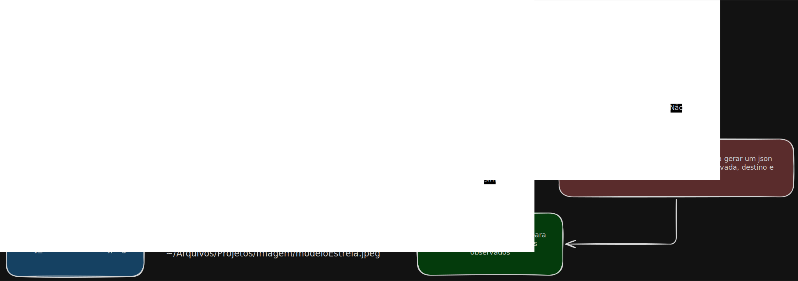

# Projeto File-Organizer - Organizador de Arquivos

## Visão Geral

Uma aplicação de monitoramento de arquivos que observa uma pasta específica buscando novos arquivos e os organiza em pastas designadas com base em seus prefixos e extensões. A aplicação foi projetada para automatizar o processo de gerenciamento de arquivos, facilitando a organização.



## Estrutura do Projeto

```plaintext
File-Organizer
├── src
│   ├── main.py          # Lógica principal da aplicação
│   ├── config/
│   │   ├── config.json  # Arquivo de configuração (gerado automaticamente)
│   │   ├── data.py      # Estruturas de dados de configuração
│   │   └── setup.py     # Gerenciamento e validação de configuração
│   └── log/             # Logs da aplicação
└── README.md            # Documentação do projeto
```

## Instalação

1. Clone o repositório para sua máquina local.
2. Navegue até o diretório do projeto.
3. Execute a aplicação:

   ```bash
   python src/main.py
   ou
   python3 src/main.py
   ```

## Configuração

A aplicação utiliza um arquivo de configuração JSON localizado em `src/config/config.json`.

Na primeira execução, se o arquivo de configuração estiver ausente, a aplicação criará automaticamente um padrão com caminhos de exemplo. Você deve editar `src/config/config.json` para definir suas preferências:

- **OBSERVED_FOLDER**: O diretório a ser monitorado para novos arquivos.
- **BASE_EXTENSION_FOLDER**: O diretório raiz para onde os arquivos organizados serão movidos.
- **PREFIX_FOLDERS**: Regras para organizar arquivos por prefixo de nome
  - (o prefixo será separado por um sublinhado, ex: `PREFIX_FOLDERS = {"INF": "Informatica/"}` moverá arquivos como `INF_123.pdf` para `Informatica/123.pdf`).
- **EXTENSIONS_FOLDERS**: Regras para organizar arquivos por extensão.

A aplicação valida a estrutura da configuração na inicialização. Se campos obrigatórios estiverem ausentes, ela perguntará se você deseja redefinir para os padrões ou editar manualmente.

## Uso

Para iniciar o monitoramento da pasta especificada, execute o script `main.py`:

```bash
python src/main.py
ou
python3 src/main.py
```

A aplicação verificará continuamente novos arquivos na pasta observada e os moverá para o destino apropriado com base em seus prefixos e extensões.
